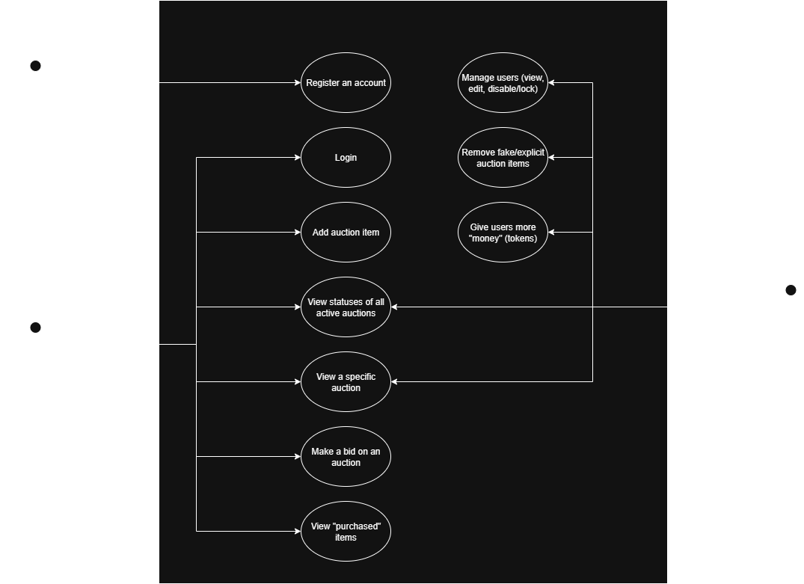
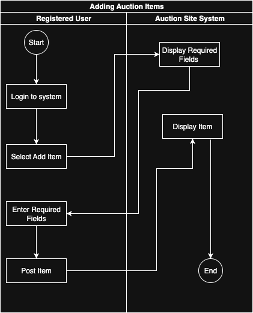

# Requirements Document

The **treasure-trove** project will implement a rudimentary proof-of-concept online marketplace platform for users to view, bid on and purchase various items up for auction.

## Use Cases

### Unregistered Users

The only action unregistered users (i.e. users without an active account) can take is to **create an account** in the system. Users are not able to interact with any of the core features of the platform until they have created an account.
Unregistered users will have to create a username and then password that satisfies input validation to log their account into the database.

### Registered Users

Once a user has an account, they are able to access the core features of the site.

Registered users can perform all of the following actions.

#### Log in

This is the first action a registered user will take when visiting the platform. In the same way that unregistered users cannot access any features of the site until they create an account and log in, users who already have an account still must log in before gaining access to the platform. The user will have to input their correct account information to access the auction site or will be prompted to try again.

#### Log out

Users will be able to log out on the autction site homepage which will bring them back to the sign-in page.

##### *Activity Diagram - Creating Account and Signing-in*

##### *Comunication Diagram - Creating Account and Signing-in*

The Following contains the Communication Diagram for a person who needs to register account and be able to sign-in to the auction site.

1. The user will input a username and password that has input validation fields.
2. The site will log the username and password into the database and send the unregistered user to a sign-in page.
3. The user is able to sign-in if their username and password is authenticated in the database.
4. The site will display the home page once the user is authenticated.

#### Add Auction Items

Logged in users can add auction items for other platform users to view and bid on.

The following information is required to add a new item:

- Name of the item
- Description of the item
- Pictures of the item
- Minimum bid (tokens)
- Auction length (days)

##### *Comunication Diagram - Adding Auction Item*

The Following contains the Communication Diagram for a user who is registered and would like to add an item for auction. 

1. Within the Communication Diagram a user needs to be registered to access the site and add an item. Once a User is registered they will be able to login to the Auction site.
2. Once the User logs into the auction site they will be authenticated and the auction site will display the full site.
3. Now that the user is logged in with full access to the site they will have the option to add an item to publish onto the auction site.
4. Once the Add item button is selected the site will display the required fields that need to be filled out before publishing the site.
5. The User will now be able to add to the required fields (ie: Name of the item, Description of the item, Pictures of the item, Minimum bid (tokens), Auction length (days)) then post the item onto the site.
6. The auction site will then process the enter fields and if they meet the requirements the site will post the item for auction. 

##### *Activity Diagram - Adding Auction Item*

The Following contains the Activity Diagram for a user who is registered and would like to add an item for auction. The Only way to proceed to posting your item is to have all the required fields filled out.

#### View All Auctions

Logged in users will be able to view all auction items available for bid on the platform, including their own items. This view will only show the important details, such as the name and main picture of the item and the time remaining in the auction.

##### *Comunication Diagram - Viewing Auction Site*

The Following contains the Communication Diagram for a user who is registered and is viewing the auction site. 

1. Within the Communication Diagram a user is able to search for items and those items will display in real time based on the characters inputed to match that item.
2. The site will display all those items that is searched for in the search bar and filter out the items that are not matching with what is being searched.
3. The user is able to select their purchased items from their history of purchases.
4. The site will bring the user to a sub-page that displays their purchases. Similar searching functionality will be available on this page as well.
5. The user can logout of the homepage at the top right of the screen.
6. The auction site will then process the request and send the user to the login screen.

#### View Auction Details

Logged in users will be able to select a particular item up for auction to view more details about it. This view will show all details of the item (name, description, picture) in addition to all details of the auction, including time remaining, current bid, and bidding history.

The bidding history shall update in real-time as other users bid on the item. It will display the amount, date, and user for each bid.

#### Bid on Auctions

Logged in users will be able to make bids on an auction from the item's details page. Bids will be made with a user's available tokens. If a user does not have enough tokens to make a bid then the bidding UX will be unavailable for that auction.

#### View Purchased Items

Logged in users will be able to view a history of all items they've purchased in the past. This view will include all of the details and bidding history for each item. It will function similarly to the [active auctions view](#view-all-auctions), except it will show purchased items instead of active auctions.

### Administrators

There will be certain administrative privileges reserved for the site managers.

The administrator role will be hardcoded for the managers' accounts. There is no way for a regular registered user to become an admin or access any admin tools.

#### User Management

Administrators will have the ability to view a list of all users in the platform and lock or remove any users who have been abusing the platform.

#### Auction Management

Administrators will have the ability to lock or remove any active auctions if they determine that an item is unsuitable for the platform or contains illegal or explicit content or products.

#### Token Management

Administrators will have the ability to gift more tokens to users. This will be done purely at the administrators' discretion.

Administrators will not be able to take tokens away once they are given. If a user is abusing the platform then the best way to mitigate the problem will be to [lock the user](#user-management).
