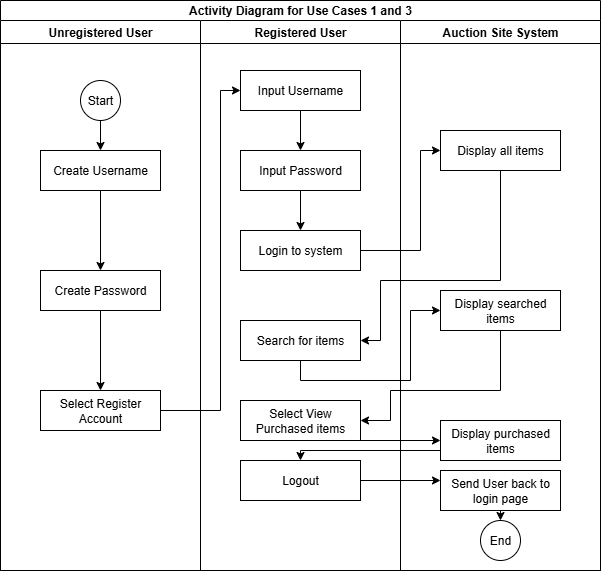
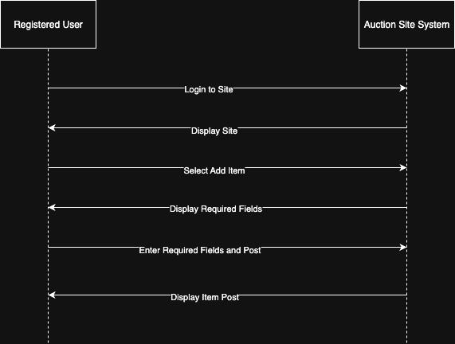
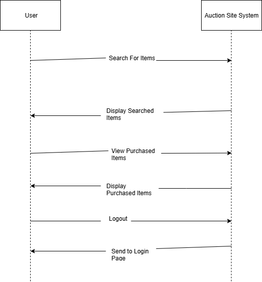
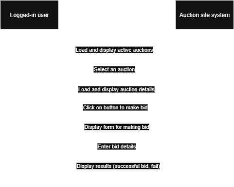

# Requirements Document

The **treasure-trove** project will implement a rudimentary proof-of-concept online marketplace platform for users to view, bid on and purchase various items up for auction.

## Use Cases

The following contains a diagram of the overall use cases for the system. These are documented in further detail below.

NOTE: the admin use cases have not been fully fleshed out yet, and they are not technically MVP requirements; however, we do want to make sure that platform admins have the ability to perform the actions shown in the diagram, even if it's not a real platform feature. In other words, we would like to integrate these features into the site, but it's possible we just perform the tasks via direct edits of the database.

### Unregistered Users

The only action unregistered users (i.e. users without an active account) can take is to **create an account** in the system. Users are not able to interact with any of the core features of the platform until they have created an account.

Unregistered users will have to create a username and then password that satisfies input validation to log their account into the database.

##### *Create an Account: Activity Diagram*

The Activity Diagram for this use case is documented [here](#creating-account-and-signing-in-activity-diagram).

##### *Create an Account: Communication Diagram*

The Communication Diagram for this use case is documented [here](#creating-account-and-signing-in-communication-diagram).

### Registered Users

Once a user has an account, they are able to access the core features of the site.

Registered users can perform all of the following actions.

#### Log in

This is the first action a registered user will take when visiting the platform. In the same way that unregistered users cannot access any features of the site until they create an account and log in, users who already have an account still must log in before gaining access to the platform. The user will have to input their correct account information to access the auction site or will be prompted to try again.

##### *Creating Account and Signing In: Activity Diagram*

##### *Creating Account and Signing In: Communication Diagram*

The following contains the Communication Diagram for a person who needs to register account and be able to sign-in to the auction site.

1. The user will input a username and password that has input validation fields.
2. The site will log the username and password into the database and send the unregistered user to a sign-in page.
3. The user is able to sign-in if their username and password is authenticated in the database.
4. The site will display the home page once the user is authenticated.

#### Add Auction Item

Logged in users can add auction items for other platform users to view and bid on.

The following information is required to add a new item:

- Name of the item
- Description of the item
- Pictures of the item
- Minimum bid (tokens)
- Auction length (days)

##### *Add Auction Item: Activity Diagram*

The following contains the Activity Diagram for a user who is registered and would like to add an item for auction. A user must fill out all the required fields in order for the item to be successfully posted.

##### *Add Auction Item: Communication Diagram*

The following contains the Communication Diagram for a registered user who would like to add an item for auction. 

1. Within the Communication Diagram a user needs to be registered to access the site and add an item. Once a User is registered they will be able to login to the Auction site.
2. Once the User logs into the auction site they will be authenticated and the auction site will display the full site.
3. Now that the user is logged in with full access to the site they will have the option to add an item to publish onto the auction site.
4. Once the Add item button is selected the site will display the required fields that need to be filled out before publishing the site.
5. The User will now be able to add to the required fields (ie: Name of the item, Description of the item, Pictures of the item, Minimum bid (tokens), Auction length (days)) then post the item onto the site.
6. The auction site will then process the enter fields and if they meet the requirements the site will post the item for auction. 

#### View All Auctions

Logged in users will be able to view all auction items available for bid on the platform, including their own items. This view will only show the important details, such as the name and main picture of the item and the time remaining in the auction.

##### *View All Auctions: Activity Diagram*

The Activity Diagram for this use case is shown [here](#creating-account-and-signing-in-activity-diagram).

##### *View All Auctions: Communication Diagram*

The Following contains the Communication Diagram for a user who is registered and is viewing the auction site. 

1. Within the Communication Diagram a user is able to search for items and those items will display in real time based on the characters inputed to match that item.
2. The site will display all those items that is searched for in the search bar and filter out the items that are not matching with what is being searched.
3. The user is able to select their purchased items from their history of purchases.
4. The site will bring the user to a sub-page that displays their purchases. Similar searching functionality will be available on this page as well.
5. The user can logout of the homepage at the top right of the screen.
6. The auction site will then process the request and send the user to the login screen.

#### View Auction Details

Logged in users will be able to select a particular item up for auction to view more details about it. This view will show all details of the item (name, description, picture) in addition to all details of the auction, including time remaining, current bid, and bidding history.

The bidding history shall update in real-time as other users bid on the item. It will display the amount, date, and user for each bid.

##### *View Auction Details: Activity Diagram*

The Activity Diagram for this use case is documented [here](#bid-on-auctions-activity-diagram).

##### *View Auction Details: Communication Diagram*

The Communication Diagram for this use case is documented [here](#bid-on-auctions-communication-diagram).

#### Bid on Auctions

Logged in users will be able to make bids on an auction from the item's details page. Bids will be made with a user's available tokens. If a user does not have enough tokens to make a bid then the bidding UX will be unavailable for that auction.

##### *Bid on Auctions: Activity Diagram*

The Following contains the Activity Diagram for a user who is registered and would like to view an auction and make a bid on it. When the user attempts to make a bid, the system verifies a number of things:

- Auction has not completed yet (i.e. the countdown has not run out yet)
- User has enough tokens to make a bid larger than the most recent bid
- User's bid is at least as large as the minimum bid, if there are no prior bids

##### *Bid on Auctions: Communication Diagram*

The following contains a communication diagram for the interactions between a user and the platform as a user views and bids on an auction item.

#### View Purchased Items

Logged in users will be able to view a history of all items they've purchased in the past. This view will include all of the details and bidding history for each item. It will function similarly to the [active auctions view](#view-all-auctions), except it will show purchased items instead of active auctions.

##### *View Purchased Items: Activity Diagram*

The Activity Diagram for this use case is documented [here](#creating-account-and-signing-in-activity-diagram).

##### *View Purchased Items: Communication Diagram*

<!-- TODO(#14) -->
